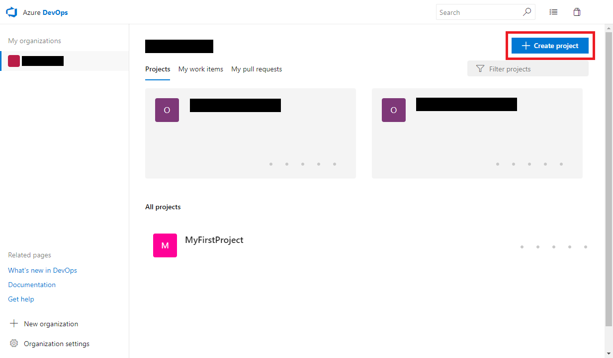
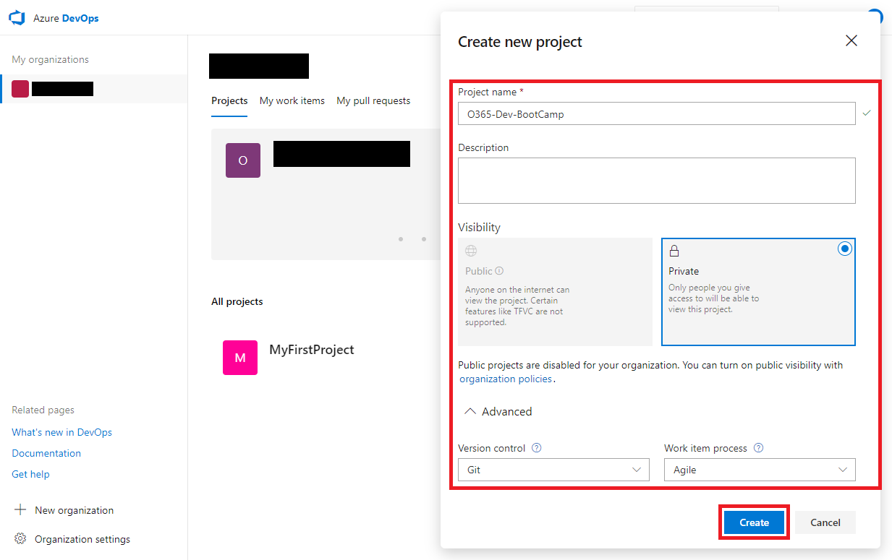

# Azure DevOps プロジェクトの作成
まだプロジェクトサイトの作成が済んでいない場合は、下記の手順を進めてください。

1. [Azure DevOps](https://dev.azure.com) の画面で「+ Create project」ボタンをクリックします。
    

2. 必要な情報を入力して、「Create」ボタンをクリックします。

    > 「Advanced > Version control」は、必ず「Git」を選択した状態にしてください。

    
