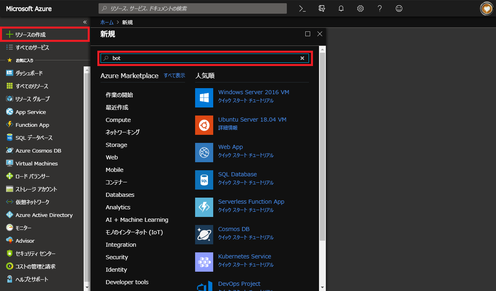
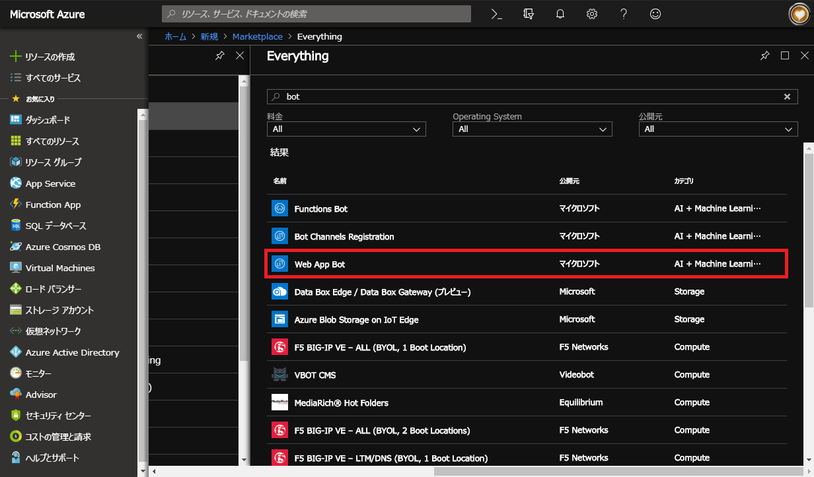
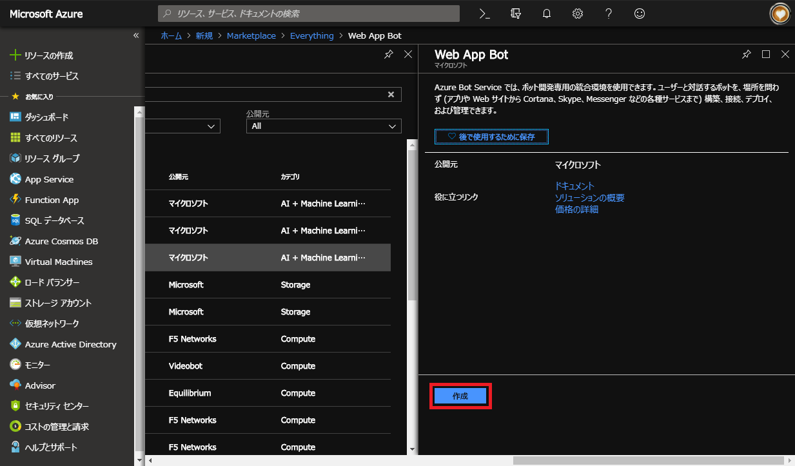
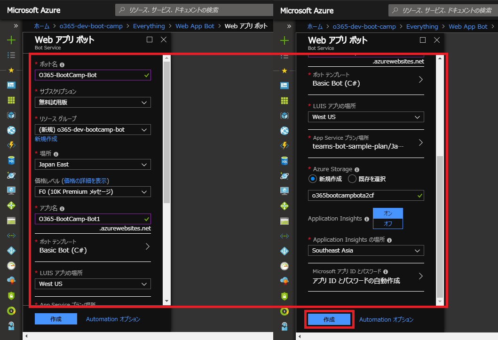

# 1. Azure Bot Service の作成
まずは、Bot の基盤となる Azure Bot Service を作成します。

1. Azure Portal にサインインします。
2. 「+リソースの作成」をクリックして検索バーに「Bot」と入力して検索を実行します。
    

3. 検索結果の中から「Web App Bot」を選択します。(Azure Functions ベースで Bot をデプロイする場合は、「Functions Bot」を選択します。)
    

4. 「Web App Bot」の概要ブレードで「作成」ボタンをクリックします。
    

5. 「Web アプリボット」の入力ブレードでリソースのパラメーターを入力します。

    |項目|入力値|備考|
    |-|-|-|
    |ボット名|<任意の名前>|bootcamp-teams-bot など|
    |サブスクリプション|<自身のサブスクリプション名>||
    |リソースグループ|<任意の名前>|bootcamp-dev-group など|
    |場所|Japan East|任意の場所でも可|
    |価格レベル|F0|本番では S1 を選択|
    |アプリ名|<任意の名前>|bootcamp-teams-bot など|
    |||Bot アプリの URL になります。|
    |ボットテンプレート|Basic Bot (C#)|既定で選択されている Bot Framework は v4 です。|
    |LUIS アプリの場所|<任意の場所>|Bot Framework v4 のみ|
    |App Service プラン/場所|<既定値>|App Service プランの場所を変える場合は、「新規作成」を選択します。|
    |Azure Storage|<既定値>||
    |Application Insights|||
    |Application Insights の場所|<任意の場所>||
    |Microsoft アプリ ID とパスワード|(既定値)||

    

6. 「作成」ボタンをクリックします。  
以上でサンプル Bot が Azure 上に展開されます。
