# 2. Microsoft Teams 用の設定
次に、Microsoft Teams で Bot を利用できるようにするための設定を行います。
この手順を実施すると、自身の Azure AD ユーザーのみが Bot を利用できるようになります。

## Azure AD アプリの登録
1. Bot を利用する Office テナントの「Azure Active Directory」を開きます。(Azure サブスクリプションと同じディレクトリの場合は、Azure Portal 上で「Azure Active Directory」を開くか、Microsoft 365 admin center から「Azure Active Directory」を開きます。)  
    [https://aad.portal.azure.com](https://aad.portal.azure.com)
2. 「Azure Active Directory」をクリックします。
    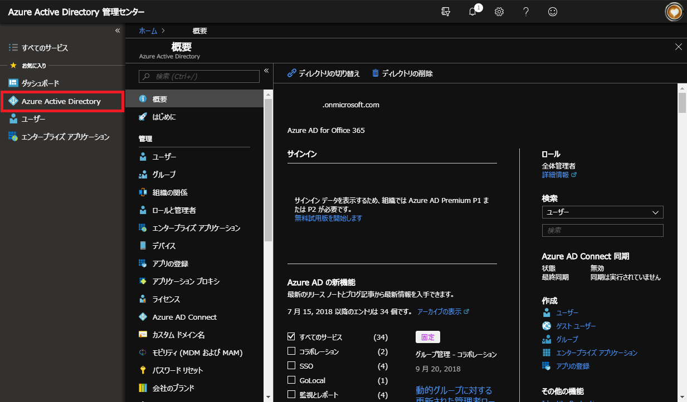

3. 「管理」セクションの「アプリ登録」を開き、「新しいアプリケーションの登録」をクリックします。
    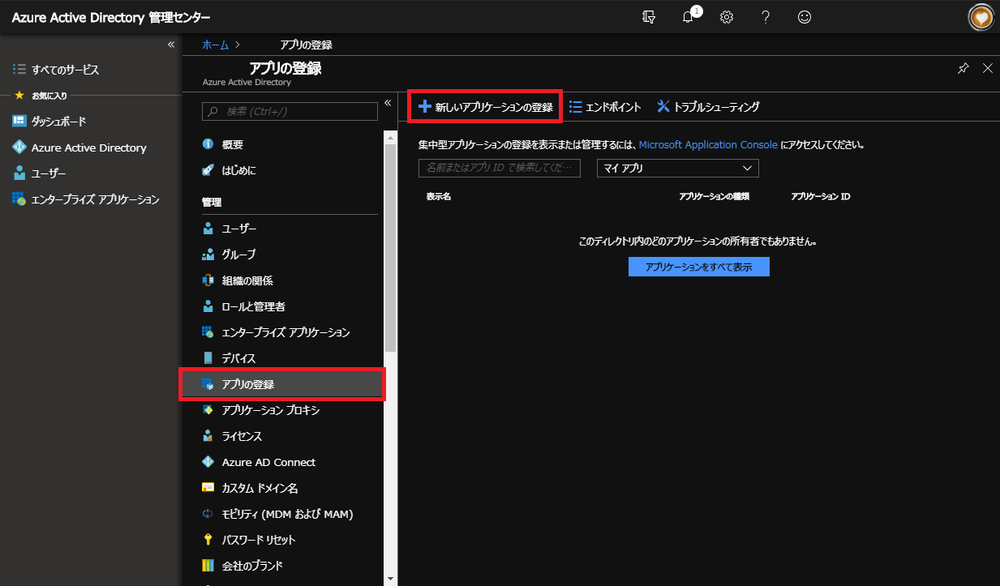

4. アプリの情報を入力して、「作成」ボタンをクリックします。

    |項目|入力値|
    |-|-|
    |名前|o365-bootcamp-bot|
    |アプリケーションの種類|Web アプリ/API|
    |サインオン URL|http://localhost|

    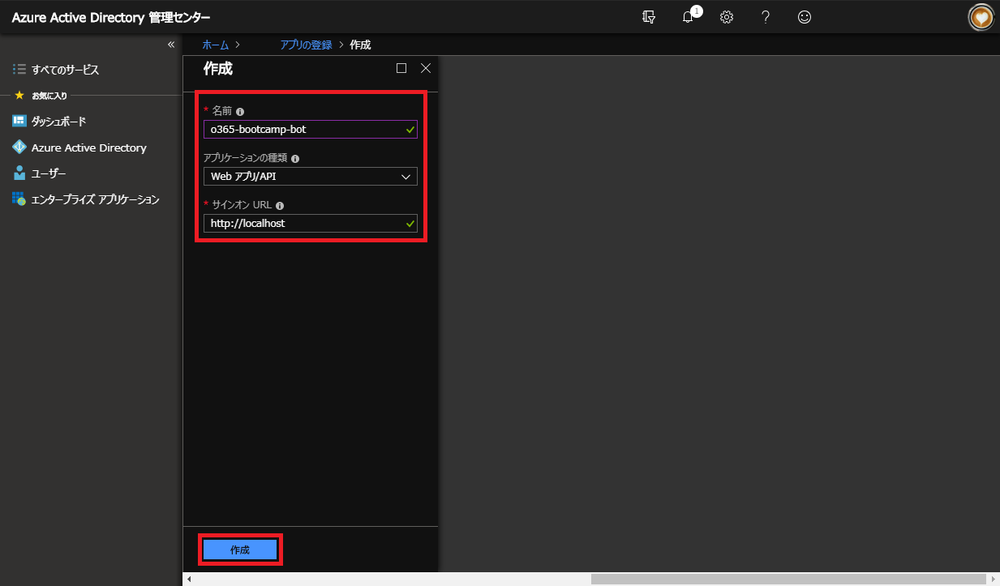

5. 「アプリケーション ID」をメモ帳などにコピーします。
6. 「設定」をクリックします。
    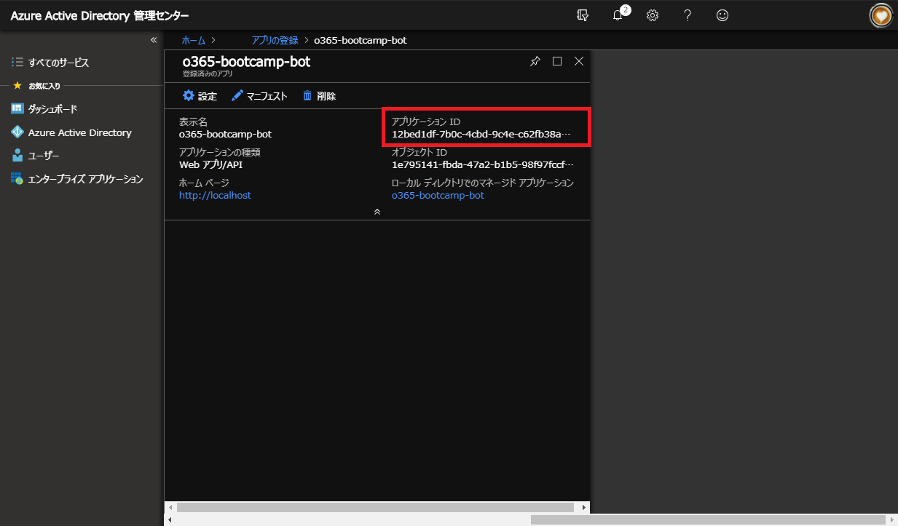

7. 「API アクセス」セクションの「キー」をクリックします。
    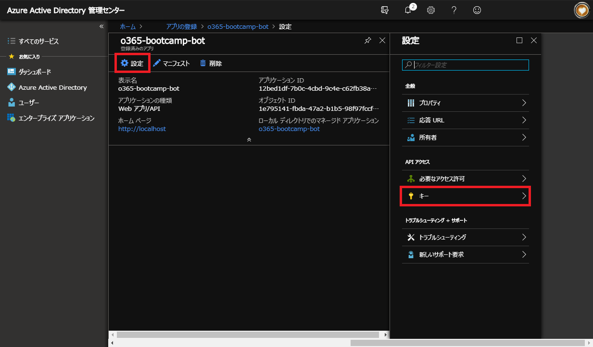

8. 「パスワード」欄に情報を入力し、「保存」ボタンをクリックします。

    |項目|入力値|補足|
    |-|-|-|
    |説明|key1|パスワード用の名前を入力します。|
    |有効期限|1 年|この有効期限が過ぎると、このパスワードを使用したアクセスが行えなくなります。|
    |値|<何も入力しません>|保存後にパスワードが表示されます。|

    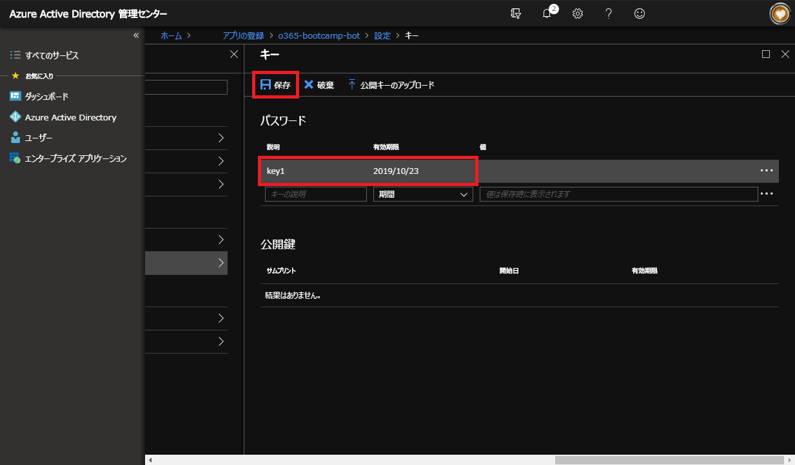

9. 表示された「値」をメモ帳などにコピーします。
    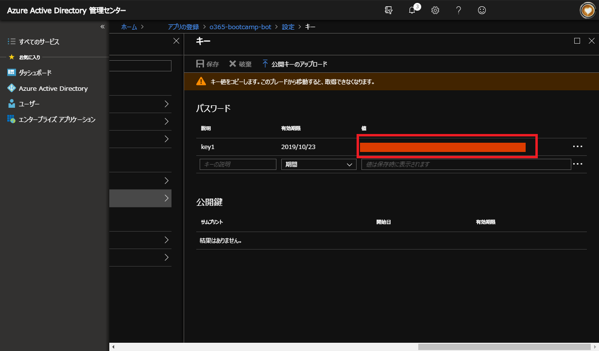

10. 画面左のメニューから「Azure Active Directory」をクリックします。
11. 「管理」セクションの「プロパティ」をクリックします。
12. 「ディレクトリ ID」をメモ帳などにコピーします。
    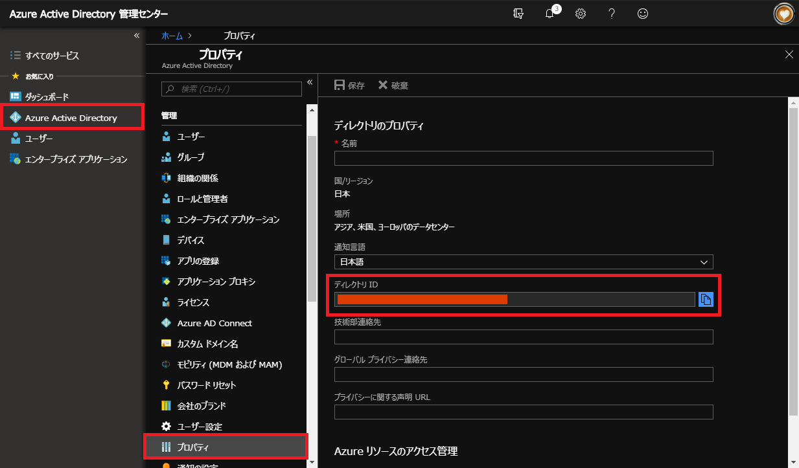

## Bot の設定
1. Azure Portal のリソースグループ画面で、Bot Service を展開したリソースグループをクリックします。
2. リソースの中から Bot Service (「種類」列が「Web アプリボット」と記載されているもの) を選択します。
    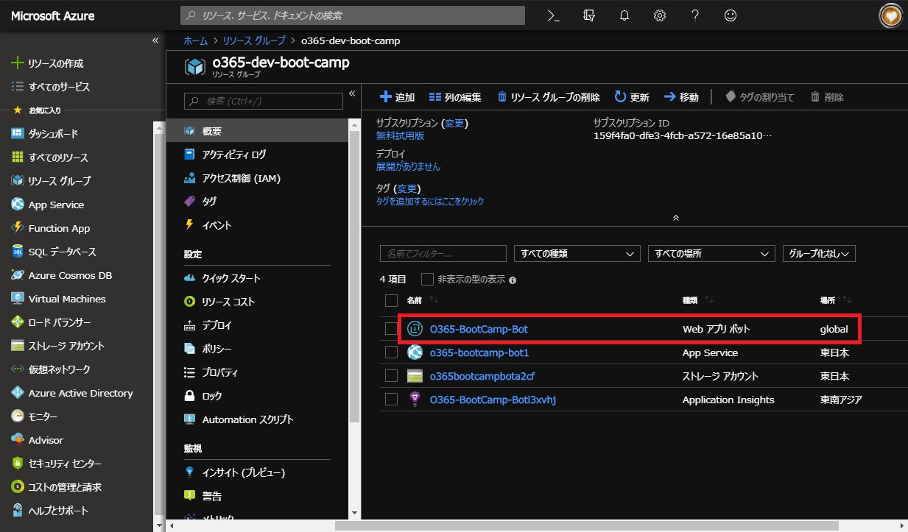

3. 「ボット管理」セクションの「チャンネル」をクリックします。
4. チャンネルの中から「Microsoft Teams」をクリックします。
    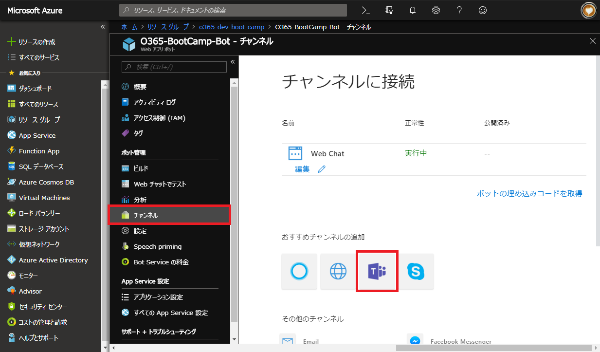

5. サービス条件に同意のうえチェックボックスにチェックを入れ、「Agree」ボタンをクリックします。
    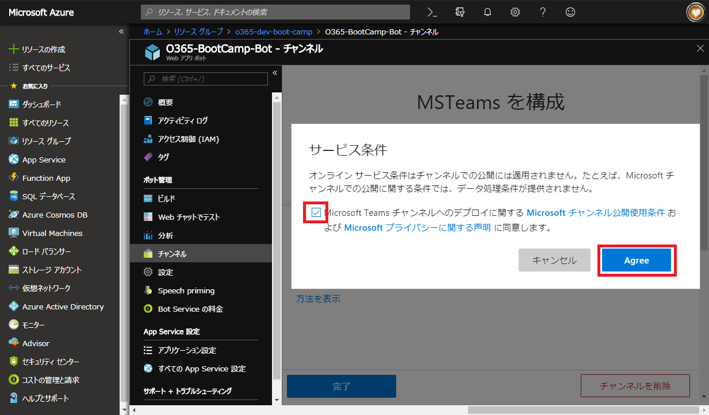

6. 「完了」ボタンをクリックします。
    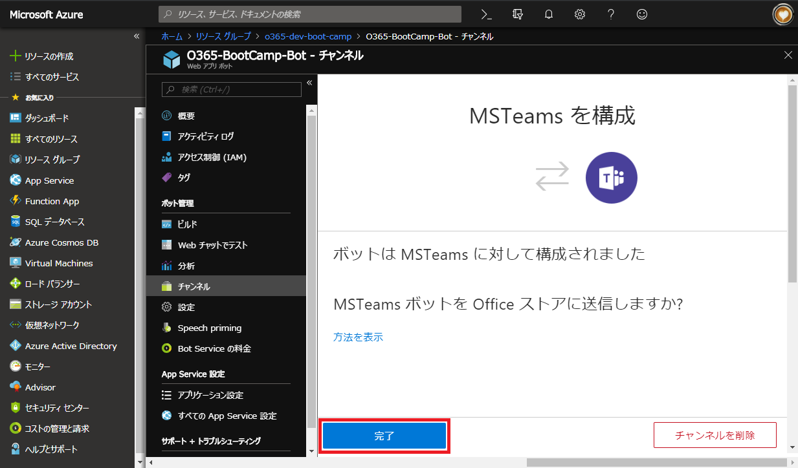

7. 「ボット管理」セクションの「設定」をクリックします。
8. 「OAuth 接続設定」セクションの「設定の追加」をクリックします。
    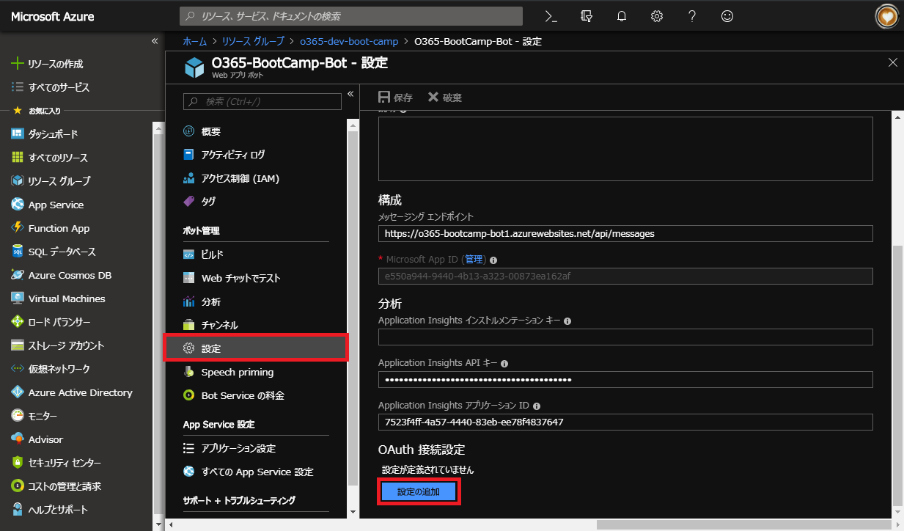

9. 入力フォームに設定値を入力して、「Save」ボタンをクリックします。

    |項目|入力値|
    |-|-|
    |Name|teams-bot-app|
    |サービスプロバイダー|Azure Active Directory|
    |Client id|<メモ帳にコピーした「アプリケーション ID」>|
    |Client secret|<メモ帳にコピーした「キー」の値>|
    |Grant Type|authorization_code|
    |Login URL|https://login.microsoftonline.com|
    |Tenant ID|<メモ帳にコピーした「ディレクトリ ID」>|
    |Resource URL|https://graph.microsoft.com|
    |スコープ|<なし>|

    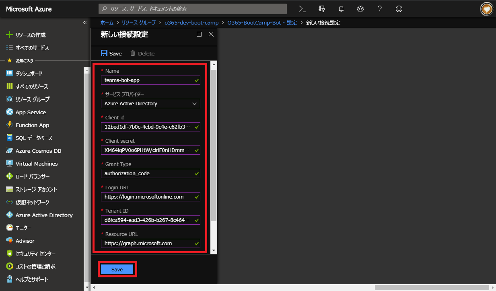

以上で Microsoft Teams との連携のための設定が完了です。  
Bot の「Microsoft App ID」をコピーして、Microsoft Teams のチャットで話しかけてみましょう。

※ Bot を自社ではない特定のテナントに対して許可する場合  
展開先テナントの Azure AD 上で「アプリの登録」を行い、その情報を Azure Bot Service に登録することで Bot が利用可能な状態になります。
