# 3. Microsoft Teams アプリの作成
前述までの状態ではまだアプリとしての展開が完了していません。  
以降の手順で作成済みの Bot を Microsoft Teams 用アプリとして定義します。

Microsoft Teams アプリには、以下の Web ページが必要となります。  
- 開発者 (アプリ提供者) Web サイト
- プライバシーポリシー
- 利用規約

「generator-teams」を利用すると、これらの雛型生成やパッケージ処理が行えます。

※上記の Web ページは一般的なブログサービスや GitHub page を利用した Web ページでも問題はありません。  
その場合は、「Microsoft Teams への展開」の手順「1」で記載する URL をブログの URL に置き換え、「4」の手順をスキップしてください。

## 事前準備
開発 PC に以下をインストールします。

- NodeJS
- エディタ (Visual Studio Code など)
- NPM モジュール (グローバルインストール)
    - Yeoman (`npm i -g yo`)
    - Gulp (`npm i -g gulp-cli`)
    - generator-teams (`npm i -g generator-teams`)
    
## プロジェクトを作成する
1. コマンドプロンプトまたは PowerShell を起動します。
2. 任意の場所にファイルを保管するためのフォルダー (ソース管理用、Microsoft Teams アプリプロジェクト用) を作成します。  
    ```
    mkdir C:\O365DevBootCampRepo
    mkdir C:\O365DevBootCampRepo\TeamsAppProject
    ```
3. 「1」で作成したディレクトリに移動します。
    ```
    cd C:\O365DevBootCampRepo\TeamsAppProject
    ```

4. 次のコマンドで generator-teams のウィザードを実行します。
    ```
    yo teams
    ```
    
    >「`--skip-install`」オプションを加えると、ウィザード終了時に `npm install` が自動的に開始されなくなります。

5. ウィザードに従って必要な情報を入力します。

    |項目|入力値|
    -|-|-
    |What is your solution name?|o365-bootcamp-teams-bot|
    |Where do you want to place the files? (Use arrow keys)|Use the current folder|
    |Title of your Microsoft Teams App project?|O365-BootCamp-Bot|
    |Your (company) name? (max 32 characters)|開発者名を入力します。|
    |What do you want to add to your project?|A Bot (複数選択する場合は、スペースキーを使用します)|
    |The URL where you will host this solution?|https://o365-bootcamp-bot1.azurewebsites.net|
    |What type of Bot would you like to use?|An already existing and running bot (not hosted in this solution)|
    |I need the Microsoft App ID for the Bot. It's found in the Bot Framework portal|<Azure Bot Service の「Microsoft App ID」を入力します>|
    |Do you want to add a static tab to your bot?|n|

    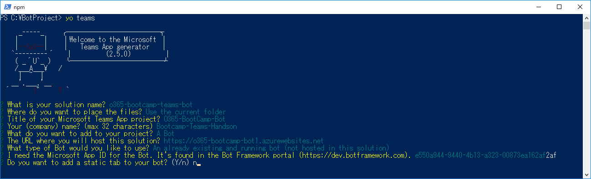


6. 作成が完了したプロジェクトを Visual Studio Code で開きます。
    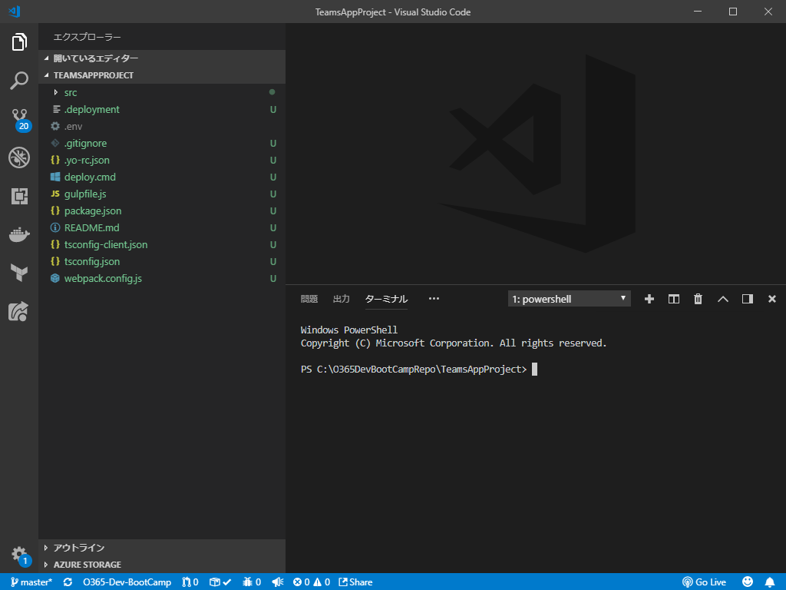

7. Visual Studio Code のターミナルで、次のコマンドを実行してローカルデバッグをしてみます。
    ```
    gulp serve
    ```

    >ビルド中にエラーが発生した場合は、「`src/app/TeamsAppsComponents.ts`」の 4 行目をコメントアウトしてください。

    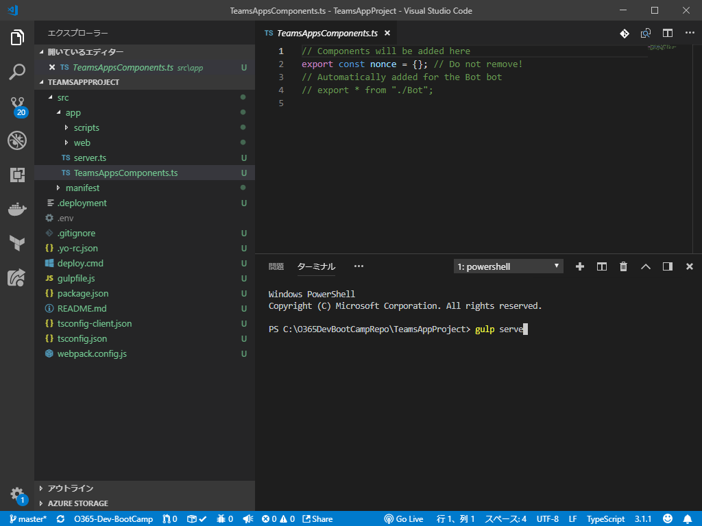


8. ブラウザで「http://localhost:3007」にアクセスして、Web ページが開けるかを確認します。
    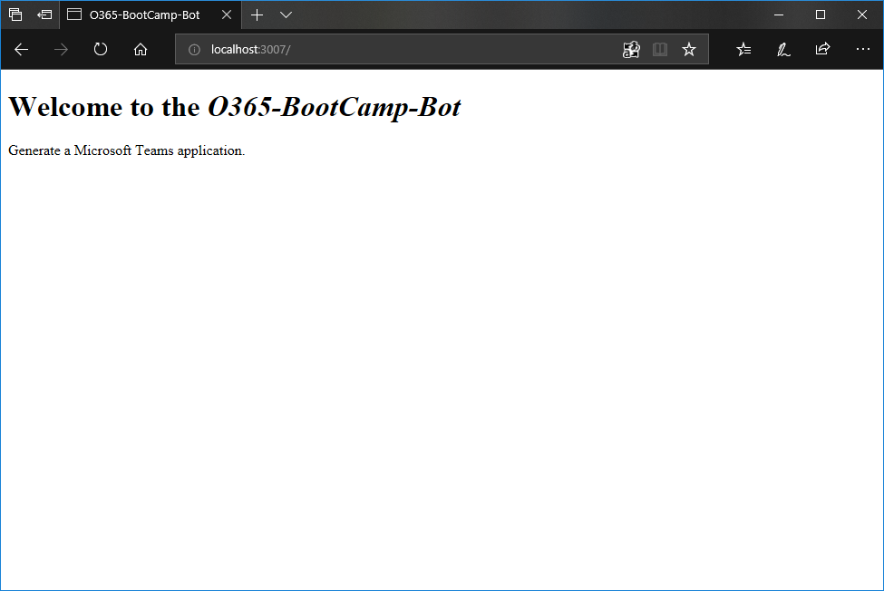

9. Visual Studio Code のターミナルで、「Ctrl + C」を実行してローカルデバッグを中止します。

## Microsoft Teams への展開を検証する
プライバシーポリシー等の Web ページをローカルでホスティングしつつ、実際にアプリを Microsoft Teams へ展開するテストを行います。
>この手順は画面確認のためのものです。スキップしても問題ありません。

1. 「`src/manifest/minifest.json`」を開き、次の項目の URL を「http://localhost:3007」に書き換えます。
    - developer.websiteUrl
    - developer.privacyUrl
    - developer.termOfUseUrl

    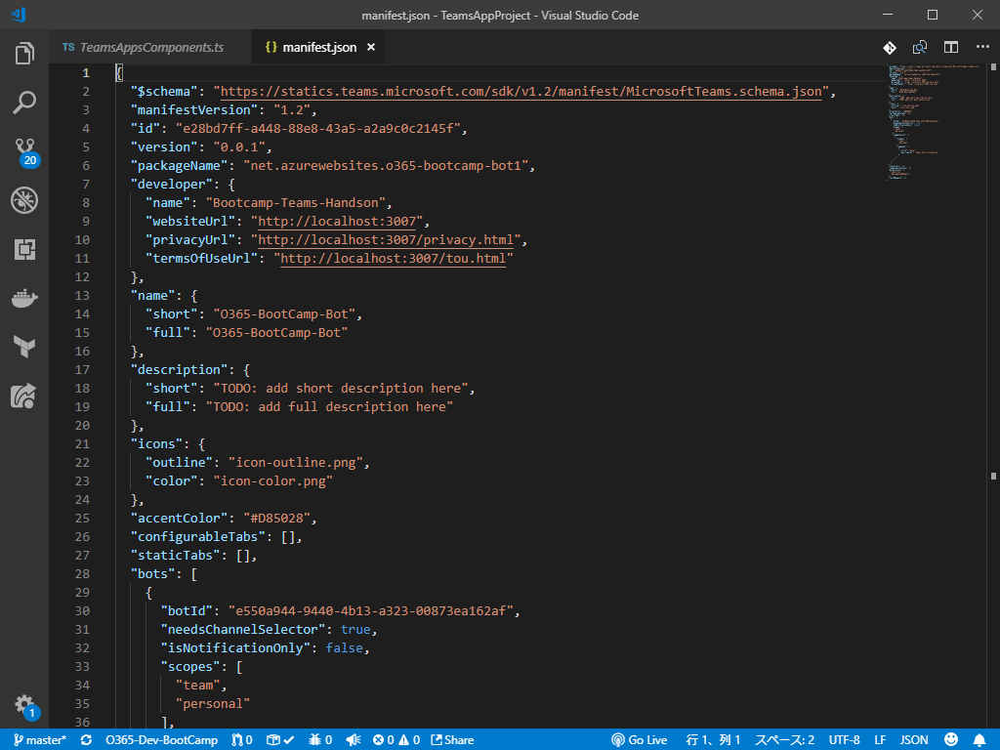

2. Visual Studio Code のターミナルで次のコマンドを実行して、manifest ファイルをデプロイ可能な zip ファイルへとパッケージ化します。

    ```
    gulp manifest
    ```

    処理が完了すると、「`package/<アプリ名>.zip`」というファイルが生成されます。

    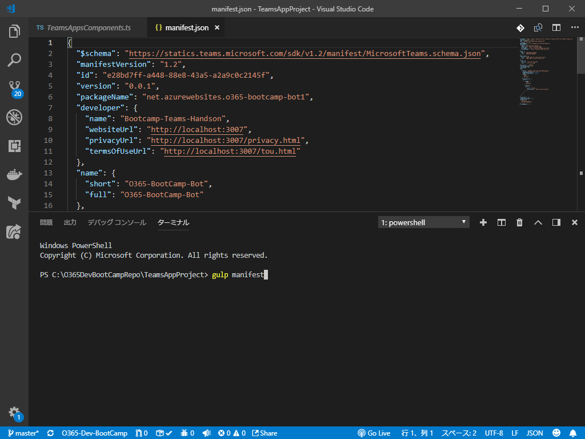

3. Visual Studio Code のターミナルで次のコマンドを実行して、ローカルで Web ページのホスティングを開始します。

    ```
    npm run build
    npm run start
    ```

    > ローカルの検証目的であるため、`gulp serve` でも問題はありません。  
    それぞれのコマンドの処理の詳細は `gulpfile.js` の各タスクを参照してください。

4. Microsoft Teams を起動します。
5. アプリバーから「ストア」を開きます。
6. 「カスタムアプリをアップロード」をクリックします。
    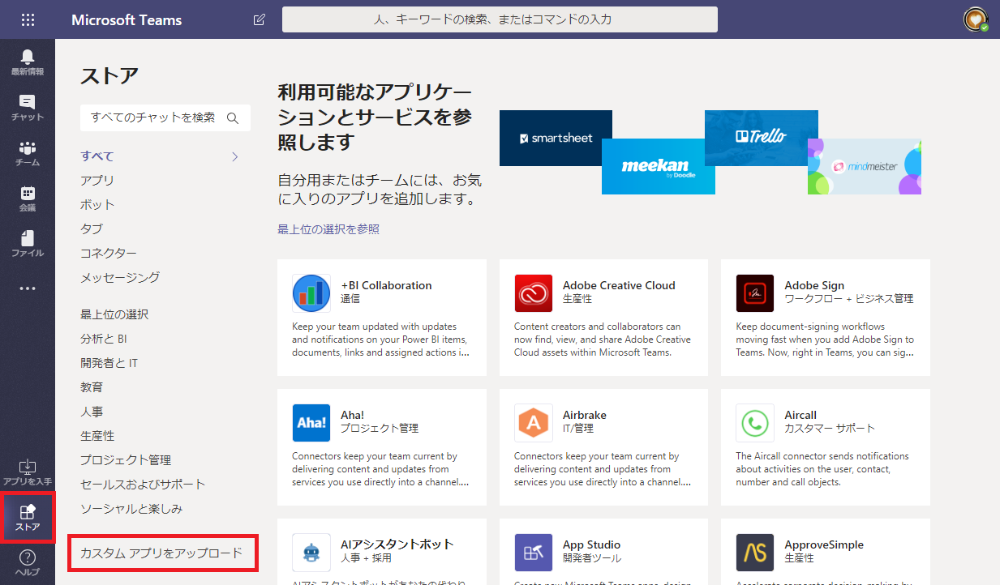

7. 「<組織名> のアップロード」をクリックします。
    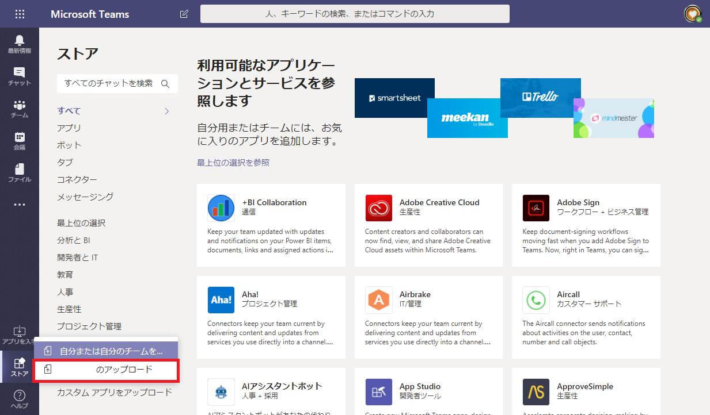

8. 先ほど生成した zip ファイル (`package/<アプリ名>.zip`) を指定します。  
アップロードが完了すると、ストアのメニュー欄に組織名が表示されるようになります。
9. 追加したアプリをクリックします。
    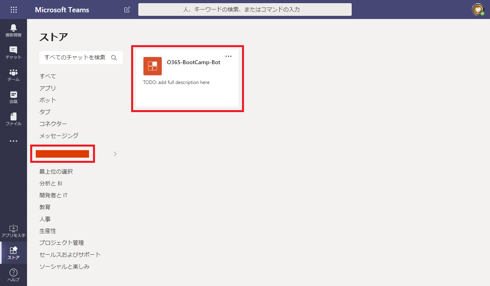

10. 追加先のチームを選択して「インストール」ボタンをクリックします。
    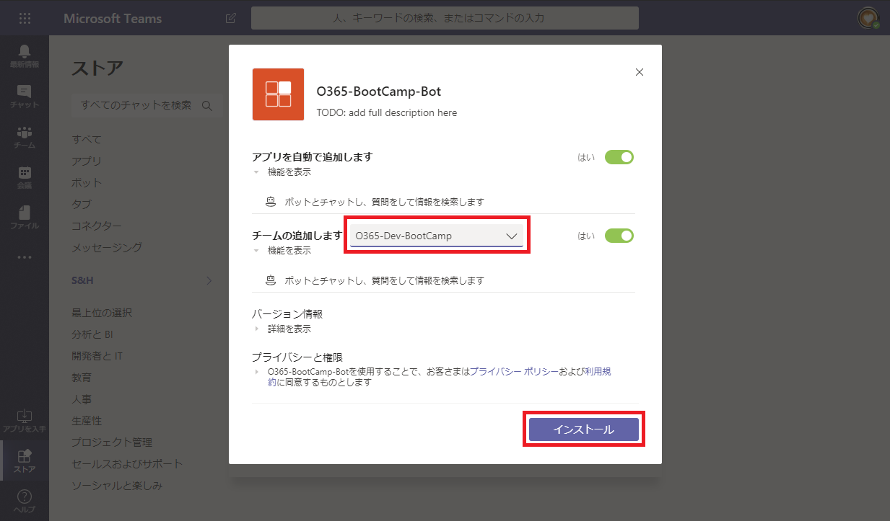

11. アプリを使用するチャネルを選択して「設定」ボタンをクリックします。
    
    >この画面各種リンクから、冒頭のプライバシーポリシーや利用規約のページにアクセス可能です。

    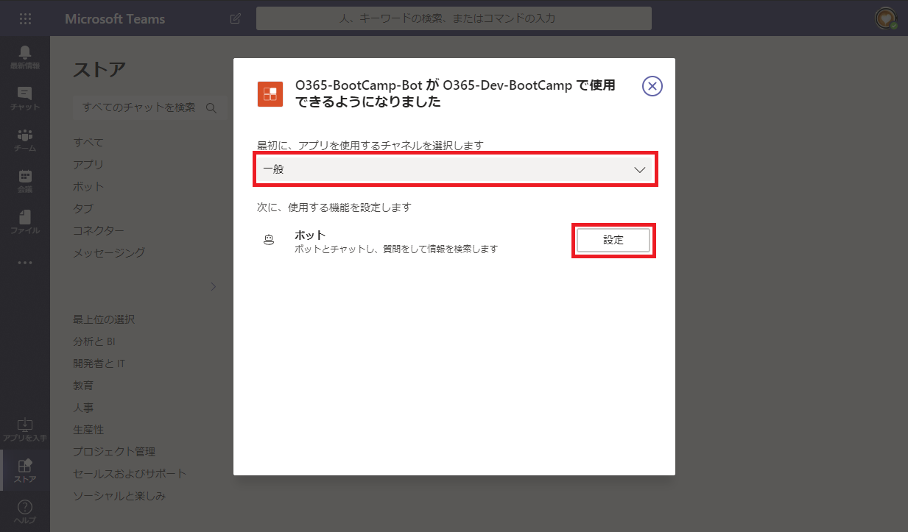

12. Bot にメンションをすることで、対話が始まります。
    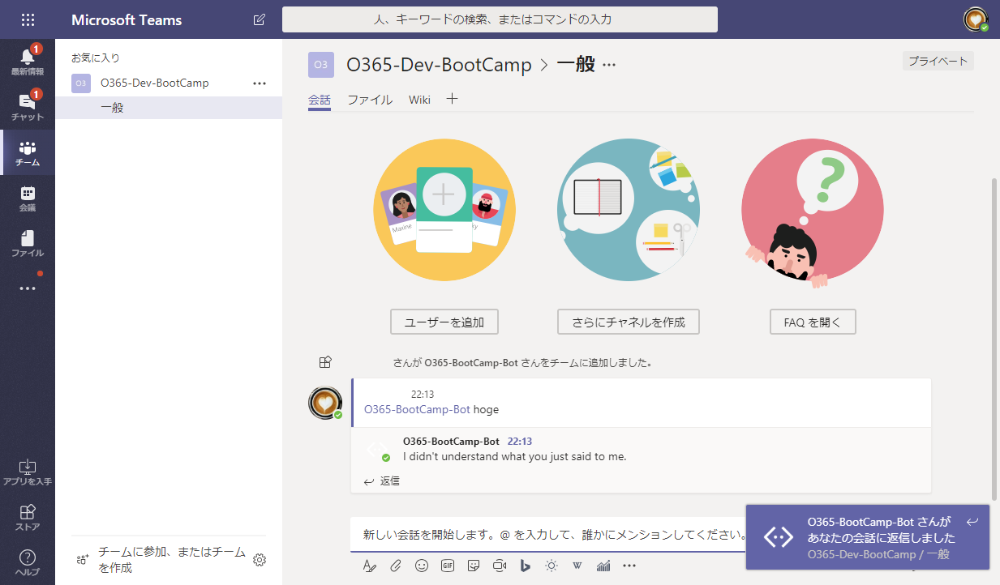

    確認が完了したら、Visual Studio Code のターミナルで、「Ctrl + C」を実行してローカルサーバーを停止します。
