# 4. ソースコードを管理する
「1. Azure Bot Service の作成」で Bot を作成しました。
しかしこのままの状態ではソースコードの開発もバージョン管理も行えません。
ソースコードを Azure DevOps に追加します。

この手順では、既に Azure DevOps のプロジェクトが作成されていることが前提です。

- Azure DevOps アカウントの作成  
    https://docs.microsoft.com/ja-jp/azure/devops/organizations/accounts/create-organization?view=vsts

- Project の作成  
    https://docs.microsoft.com/ja-jp/azure/devops/organizations/projects/create-project

## リモートリポジトリを Clone する
1. ブラウザでソース管理に使用する Azure DevOps プロジェクトにアクセスします。
2. サイドバーから「Repos」をクリックします。
3. 画面右上の「Clone」をクリックします。
    

4. 「IDE」セクションの「Clone in Visual Studio」クリックします。

    選択肢が表示されていない場合は、「∨」をクリックしてメニューから選択してください。

    > Visual Studio がインストールされていない方は「VS Code」を選択するか、Git コマンドからソースを Clone してください。
    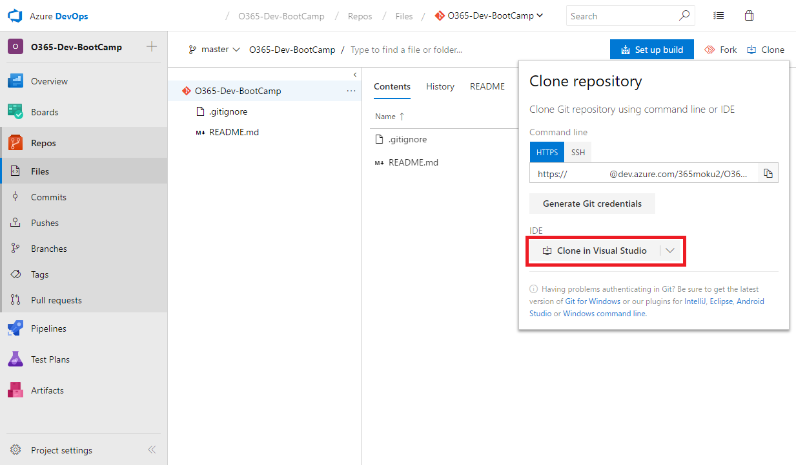

5. 前章で作成したフォルダーを指定して、リポジトリを Clone します。

    >以降の手順で Visual Studio を利用するため、Visual Studio はそのまま起動したままにしてください。

    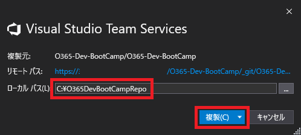

## ソースコードを Azure DevOps の管理下に配置する
1. 「1. Azure Bot Service の作成」で作成した Azure Bot Service にアクセスします。
2. 「ボット管理」セクションの「ビルド」をクリックします。
3. 「Build: Get set up with local development」の「zip ファイルをダウンロード」ボタンをクリックしてダウンロードを開始します。
    
    >少し時間がかかる場合があります。

    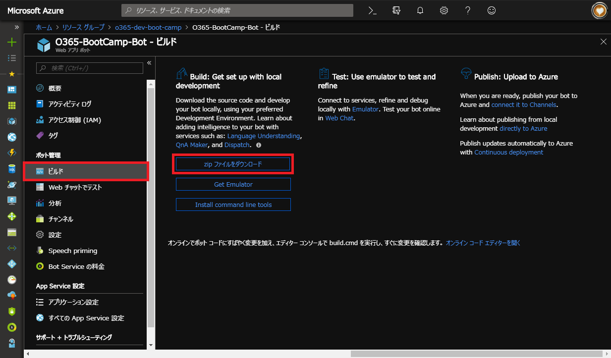

4. エクスプローラーを起動して、前述で作成したリモートリポジトリのフォルダーを開きます。
5. Bot プロジェクトを格納するためのフォルダーを作成します。
(`C:\O365DevBootCampRepo\BotProject` や `C:\O365DevBootCampRepo\<Azure Bot Service Name>` などわかりやすい名前)
    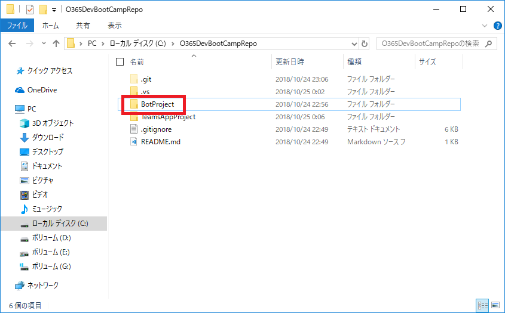

6. 前項で作成したフォルダー内に、手順「3」でダウンロードした zip ファイルの中のファイルをすべてコピーします。
    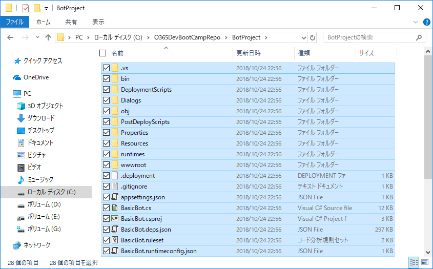

7. Visual Studio を開きます。
8. 「チームエクスプローラー」を開きます。
リポジトリの複製時に「チームエクスプローラー」が開いていない場合は、メニューバーから「表示 > チームエクスプローラー」をクリックしてください。
9. 「変更」ボタンをクリックします。
    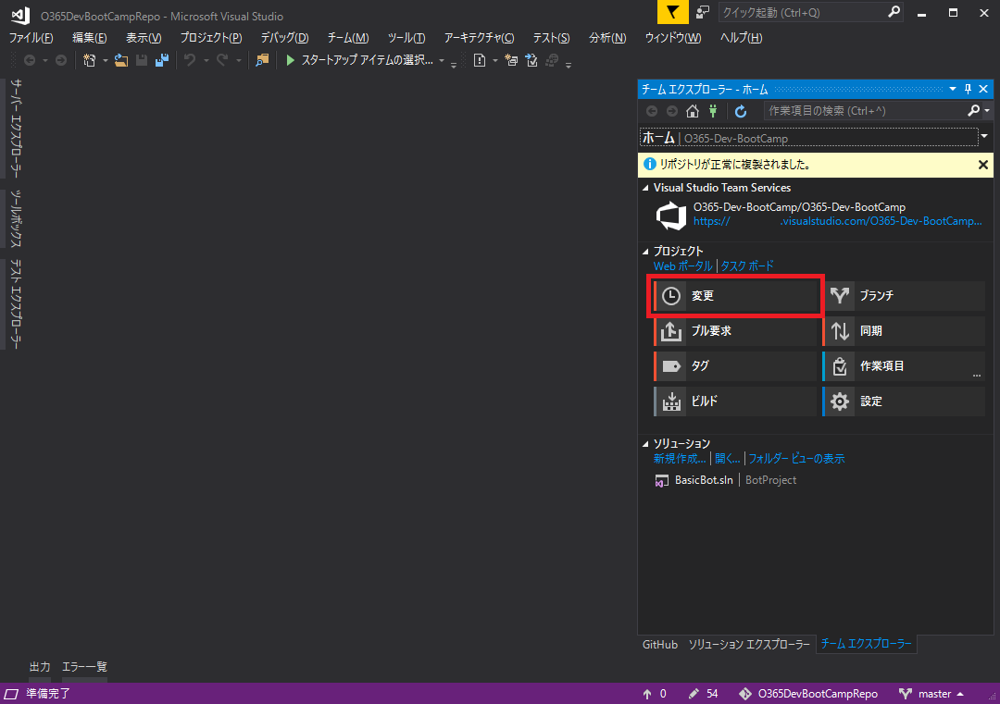

10. テキストボックスにコメントを追加します。  
(「Bot プロジェクトをソース管理に新規追加」など)
11. 「変更」セクションの「+」ボタンをクリックしてコミットするファイルを確定します。
    「ステージング済みの変更」セクション内を下にスクロールすると、前章の Microsoft Teams アプリ用プロジェクトも追加されていることが確認できます。  
    ここでは、Bot と Microsoft Teams アプリそれぞれのプロジェクトをまとめて Azure DevOps にコミットします。
    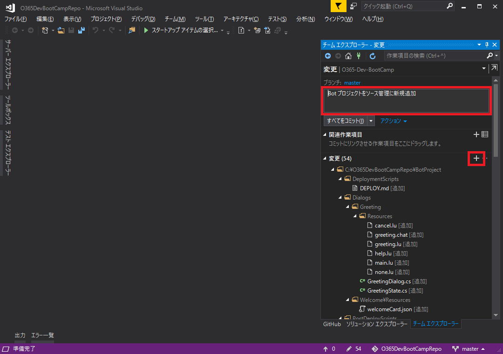

12. 「ステージング済みをコミット」ボタンをクリックします。
    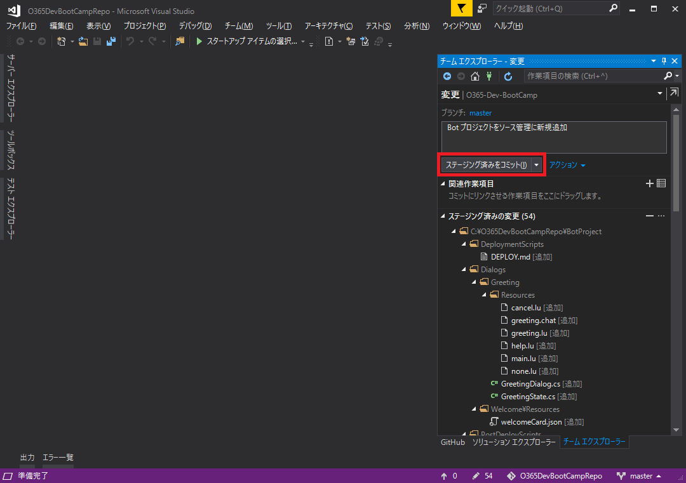

13. 「同期」リンクをクリックします。
    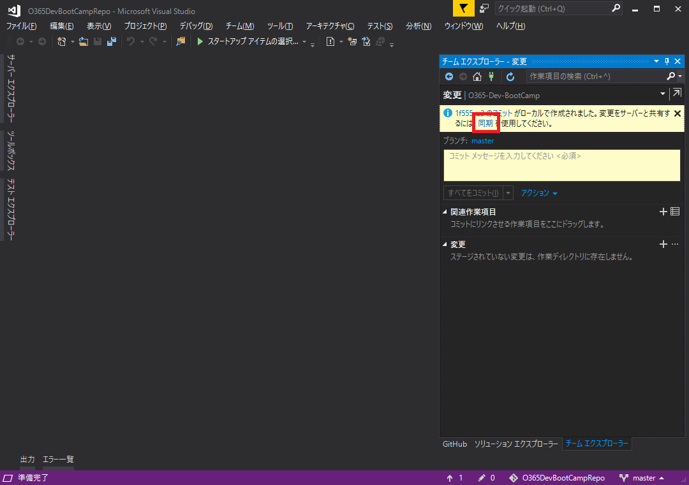

14. 「出力方向のコミット」セクションの「プッシュ」リンクをクリックします。
プッシュ処理の完了後に再度 Azure DevOps を開くと、ソースファイルが格納されていることがわかります。
    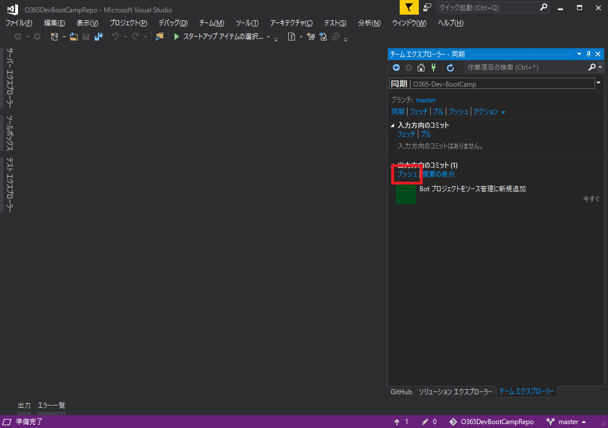
    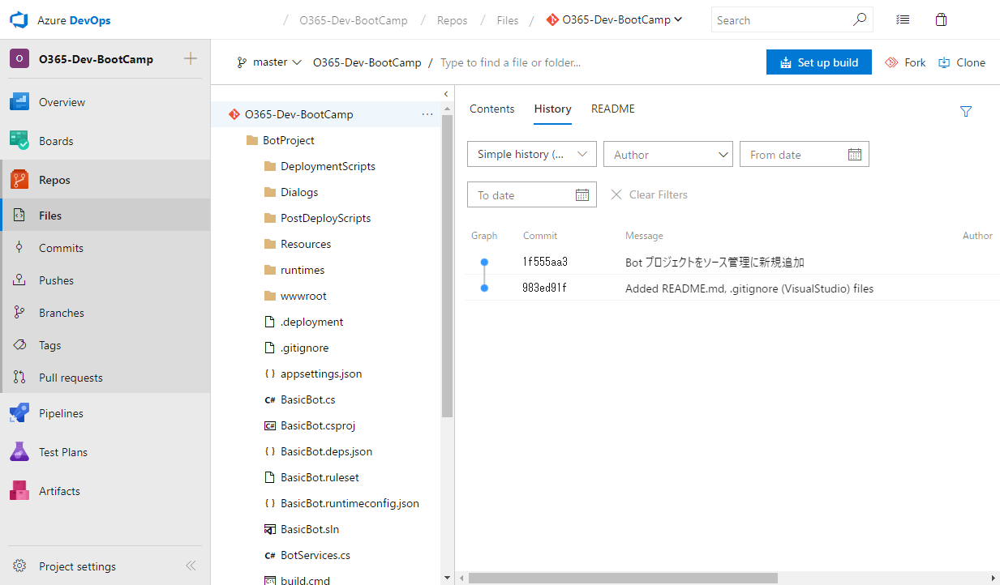
