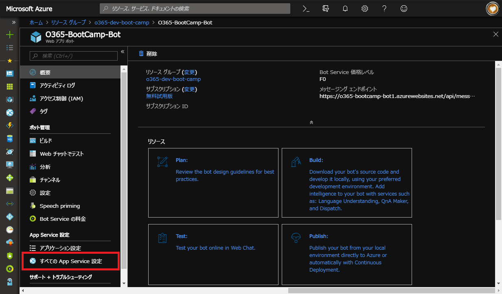
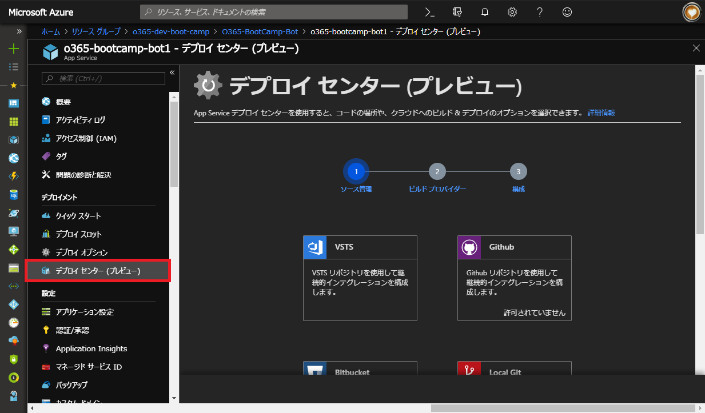
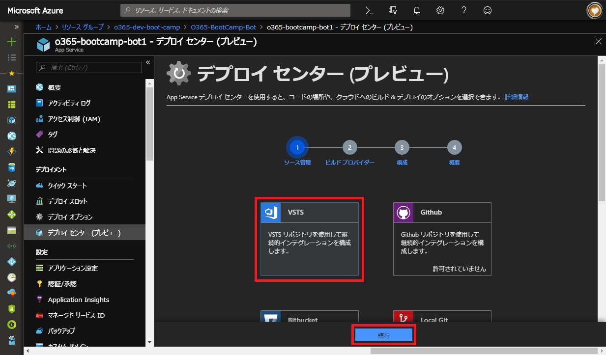
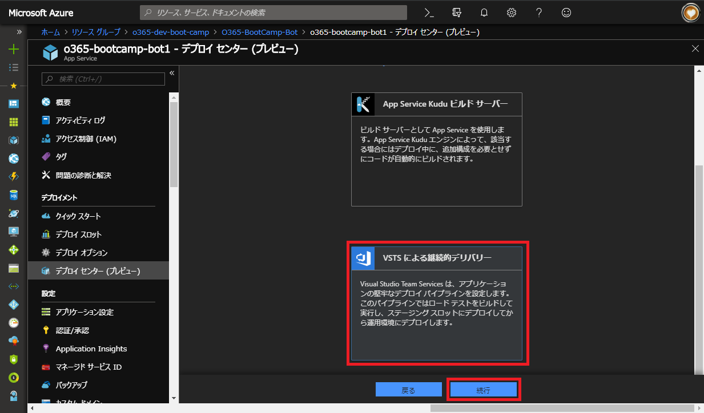
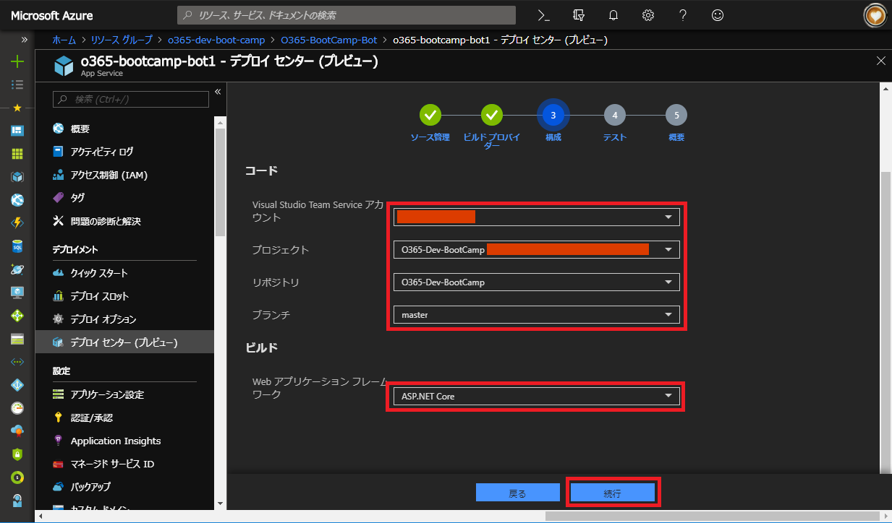
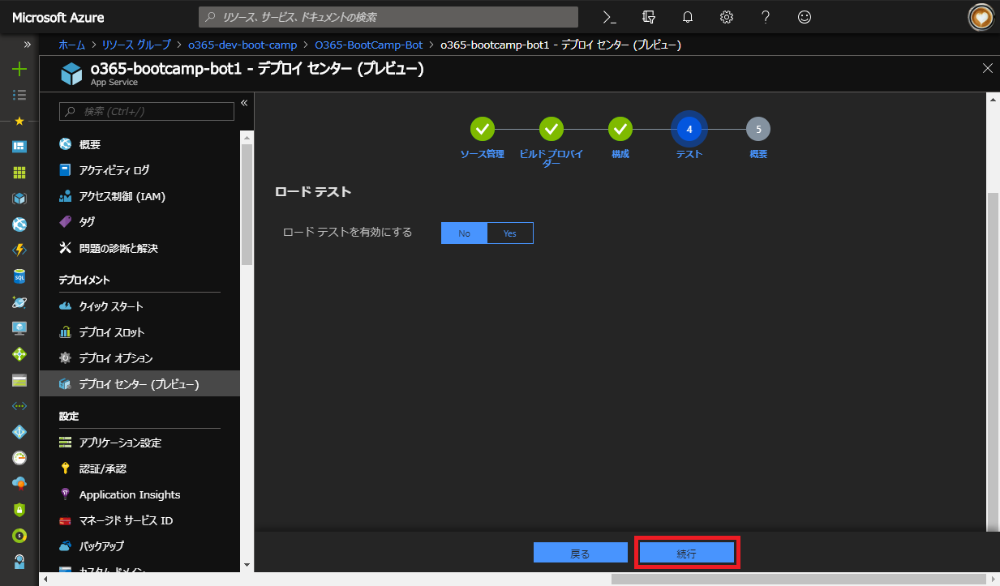
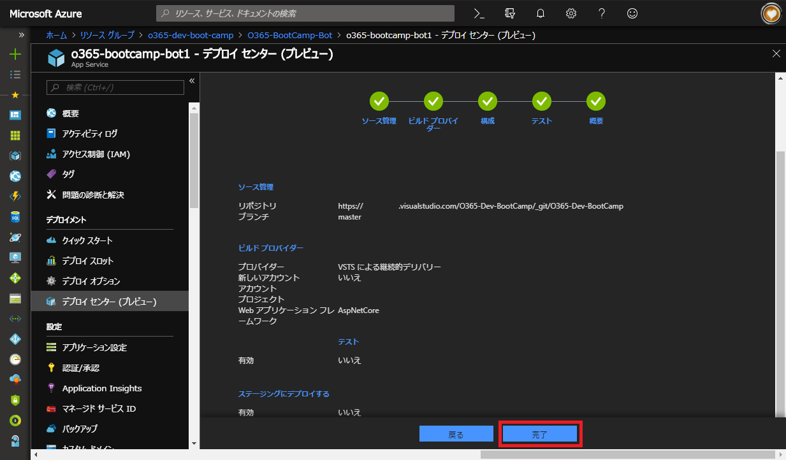
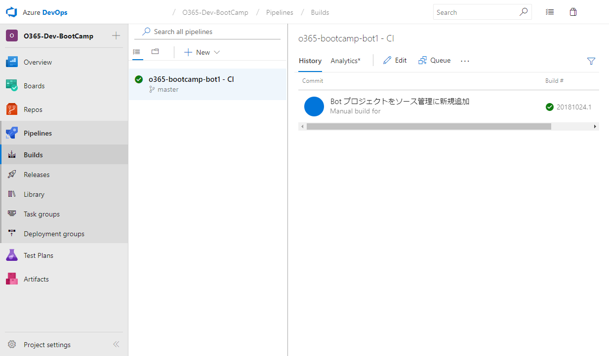
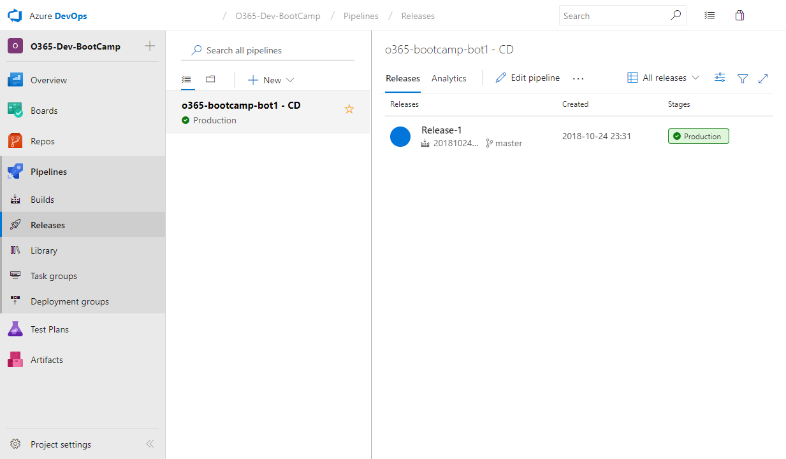
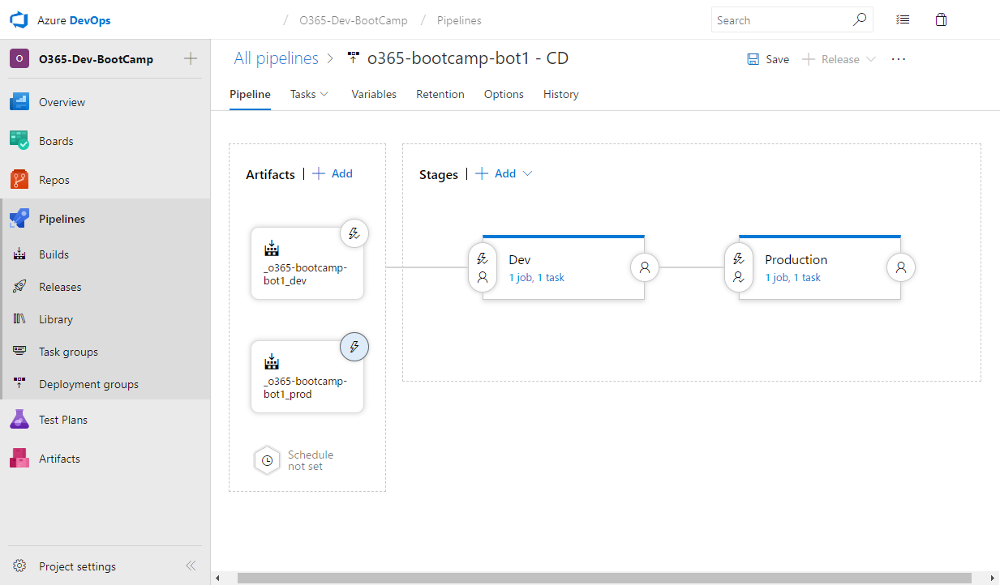

# 5. 自動デプロイの構成
前章までの手順でソースのバージョン管理が行えるようになりました。  
この章では、Azure DevOps に格納された Bot プロジェクトを Azure Bot Service に自動的にデプロイする手順を記載します。

1. ブラウザで Azure Bot Service を開きます。
2. 「ボット管理」セクションの「すべての App Service 設定」をクリックします。
    

3. 「デプロイメント」セクションの「デプロイセンター (プレビュー)」をクリックします。
    

4. 「VSTS」を選択して「続行」ボタンをクリックします。
    

5. 「VSTS による継続的デリバリー」を選択して「続行」ボタンをクリックします。
    

6. 「コード」セクションに、前章まで使用していた Bot プロジェクトが含まれる Azure DevOps 環境の情報を選択します。
7. 「Web アプリケーションフレームワーク」の項目で「ASP.NET Core」を選択します。
8. 「続行」ボタンをクリックします。
    

9. 「ロードテスト」は実施しないため「No」を選択した状態で「続行」ボタンをクリックします。
    

10. 「完了」ボタンをクリックします。
    
    
    構成が完了すると、Azure DevOps で自動的にビルドおよびデプロイが開始されます。
    
    

    これら Pipeline が作成された状態では、Azure DevOps 上の master ブランチにコミットがあった際に自動ビルドが開始され、ビルド完了後は自動的に Azure Web App にデプロイが行われます。
    
    本番運用時では、デプロイ先の環境 (本番・検証・開発など) や運用ルール (GitHub flow など) にあわせて、手動実行や承認処理を Pipeline に追加してください。
    
