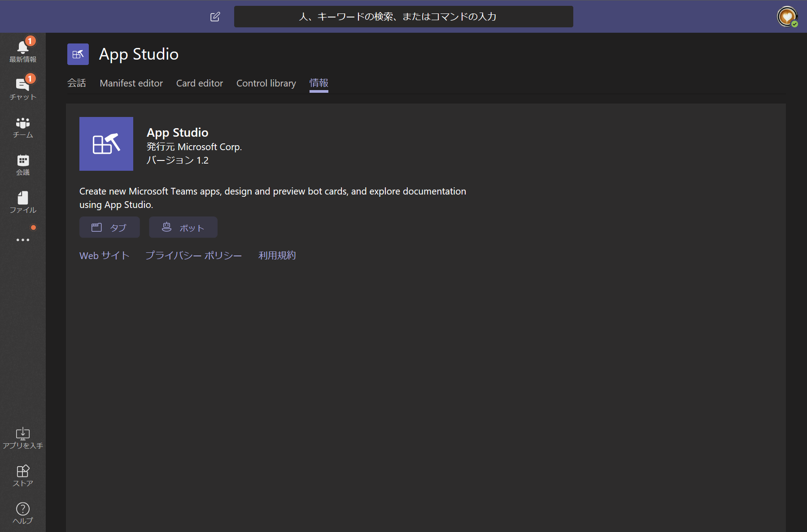
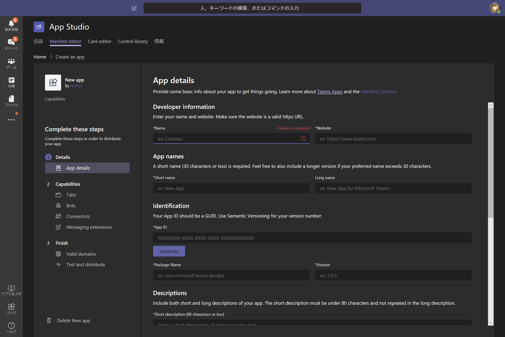
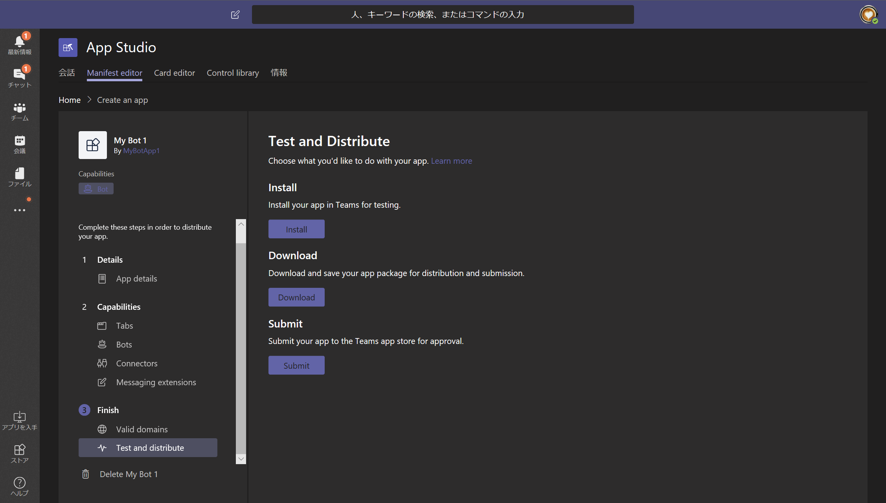

# Microsoft Teams アプリの作成
今回は Yeoman Generator から manifest.json をパッケージ化しました。

もし既に開発済みの Bot や Web ページが存在する場合は、Microsoft Teams Store から「App Studio」をインストールすることで、UI 上から manifest の構成を行うことができます。
    

「Manifest editor」タブから、アプリの名前や開発者情報などを登録します。
    

manifest の構成後は、そのまま Microsoft Teams にインストールしたり、申請をあげたりするボタンが用意されています。
    

